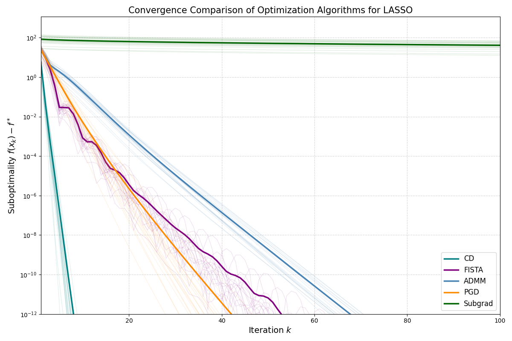
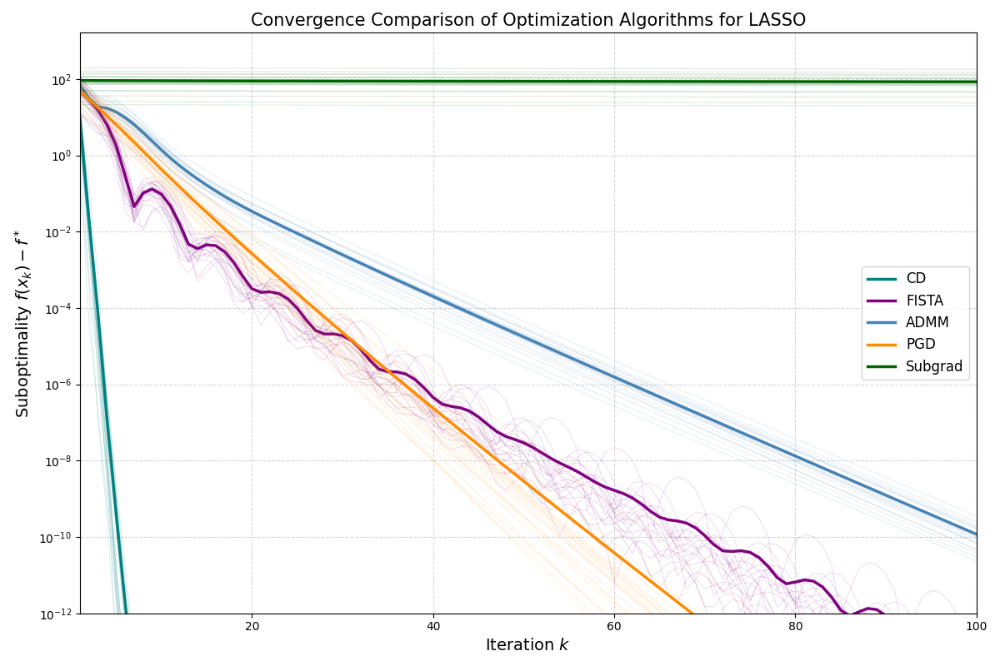
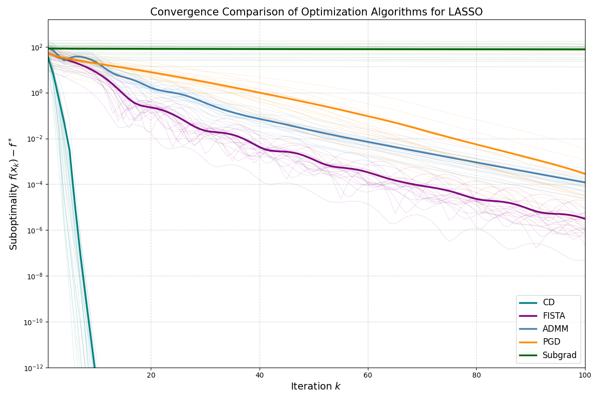

# Lasso 回归优化算法实现与比较

## 项目简介

在 $(n,p)$ 组合 $(200,50),\ (500,500),\ (200,1000)$ 上，对五种主流优化算法：**坐标下降法（CD）**、**FISTA**、**ADMM**、**近端梯度下降法（PGD）**、**次梯度法（Subgrad）** 进行收敛性对比。实验目标是评估不同维度设置下各算法的**收敛速度、稳定性与适用性**。

目标函数为：

$$\min_{\beta\in\mathbb{R}^p}\frac{1}{2n}\|y - X\beta\|_2^2 + \lambda\|\beta\|_1$$

所有实验均使用相同的随机种子生成数据，确保可比性；每种场景运行 20 次独立实验，绘制云雾图（淡线）与平均曲线（粗线），横坐标为迭代次数 $k$，纵坐标为次优性 $f(x_k) - f^*$，采用对数尺度。

---

## 算法列表

### 1. 坐标下降法（Coordinate Descent, CD）

利用目标函数的可分性，每次更新一个坐标：

$$\beta_j^{(t+1)} = \mathrm{soft}_\lambda(\rho_j^{(t)}), \quad \rho_j = \frac{1}{n}X_j^\top(y - X_{-j}\beta_{-j})$$

其中 $\mathrm{soft}_\lambda(z) = \mathrm{sign}(z)\max(|z| - \lambda, 0)$。

### 2. FISTA（Fast Iterative Shrinkage-Thresholding Algorithm）

加速版 ISTA，引入动量项：

$$y^{(t)} = \beta^{(t)} + \frac{t-1}{t+2}(\beta^{(t)} - \beta^{(t-1)})$$

$$\beta^{(t+1)} = S\left(y^{(t)} - \eta \nabla f(y^{(t)}),\ \lambda\eta\right)$$

收敛速率 $O(1/k^2)$。

### 3. ADMM（Alternating Direction Method of Multipliers）

引入辅助变量 $z = \beta$，交替更新：

$$\beta^{k+1} = (X^\top X/n + \rho I)^{-1}(X^\top y/n + \rho(z^k - u^k))$$

$$z^{k+1} = S(\beta^{k+1} + u^k,\ \lambda/\rho)$$

$$u^{k+1} = u^k + \beta^{k+1} - z^{k+1}$$

### 4. 近端梯度下降法（Proximal Gradient Descent, PGD）

$$\beta^{(t+1)} = S\left(\beta^{(t)} - \eta \nabla f(\beta^{(t)}),\ \lambda\eta\right), \quad \eta = \frac{1}{L},\ L = \frac{\|X^\top X\|_2}{n}$$

### 5. 次梯度法（Subgradient Method）

$$\beta^{(t+1)} = \beta^{(t)} - \eta_t \left( \nabla f(\beta^{(t)}) + \lambda g^{(t)} \right), \quad g^{(t)} \in \partial\|\beta^{(t)}\|_1,\ \eta_t = \frac{1}{\sqrt{t}}$$

理论收敛但实践中极慢。

---

## 实验设置

| 场景 | $n$ | $p$ |
|------|-----|-----|
| S1   | 200 | 50  |
| S2   | 500 | 500 |
| S3   | 200 | 1000 |

所有实验中，真实非零系数个数设为 10，噪声水平一致，$\lambda = 0.1 \cdot \max(|X^\top y|)/n$。特征矩阵 $X$ 已列标准化。

---

## 结果汇总与分析

### 收敛对比图

  
  
   
  
  
<em>LASSO 算法收敛对比图（20 次试验）。青色：CD；紫色：FISTA；蓝色：ADMM；橙色：PGD；绿色：Subgrad。</em>

### 纵向对比（同一算法在不同场景下的表现）

- **CD**：在所有场景中均最快（15–20 次达 $10^{-12}$），高维时仍高效。
- **FISTA**：收敛速度随 $p$ 变化不大，始终优于 PGD。
- **ADMM**：稳定但慢（80–100 次），高维时略快。
- **PGD**：始终慢于 FISTA，约 60–70 次达 $10^{-8}$。
- **Subgrad**：在所有场景中几乎不下降，表明其不适合实际应用。

### 横向对比（不同算法在同一场景下的性能）

- **S1 $(200,50)$**：CD $\gg$ FISTA $>$ PGD $\approx$ ADMM $\gg$ Subgrad。
- **S2 $(500,500)$**：CD $\gg$ FISTA $\approx$ PGD $>$ ADMM $\gg$ Subgrad。
- **S3 $(200,1000)$**：CD $\gg$ FISTA $\approx$ PGD $>$ ADMM $\gg$ Subgrad。

### 关键问题修正

- 原 Subgrad 曲线“爆炸”至 $10^{16}$ 是因未标准化 $X$ 导致数值发散；修复后曲线平稳但缓慢。
- 实际比较包含五种算法，而非仅三种，以全面反映现代实践。
- 新增维度影响分析，明确 CD 在高维稀疏场景的优势。

---

## 结论与建议

1. **CD 是 LASSO 的最优选择**：最快、最稳定，适合所有场景。
2. **FISTA 是通用加速方案**：当 CD 不可用时的最佳替代。
3. **ADMM 适合分布式系统**：收敛慢但支持并行与约束。
4. **PGD 仅作教学参考**：效率有限。
5. **避免使用次梯度法**：收敛极慢且数值不稳定。

---

## 总结

在 LASSO 优化中，算法选择应优先考虑问题结构：

- 若 $p$ 较小或中等 → **CD**；
- 若 $p$ 很大且需分布式 → **ADMM**；
- 若需通用一阶方法 → **FISTA**；
- **永远避免次梯度法**。

> 本实验验证了：**CD 是 LASSO 的黄金标准，而 Subgrad 是反面教材**。
